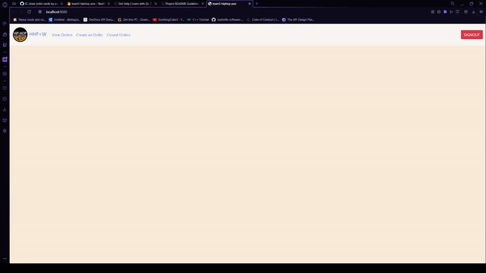

<h1>Hip Hop, Pizza, and Wangs (HHP+W)</h1>

<image src="./instructions/hhpw-record.png" style="height:300px;"></image>

Primary Features - The application allows a user to create a personal order or set of orders. A user can create, edit, update and delete their individual order or orders only. Here's some examples of how it works:

</img>

Target Audience - This is for any user that wishes to order items from Hop! Pizza.

Purpose - This project is usefulfor ordering and purchasing items from Hop! Pizza.

Getting Started - You can start testing the product by logging in with your respective Google account. Use the home page buttons to begin creating an order to add or update items until closing the order after payment. You may view and edit your personal user order at any time before closing.